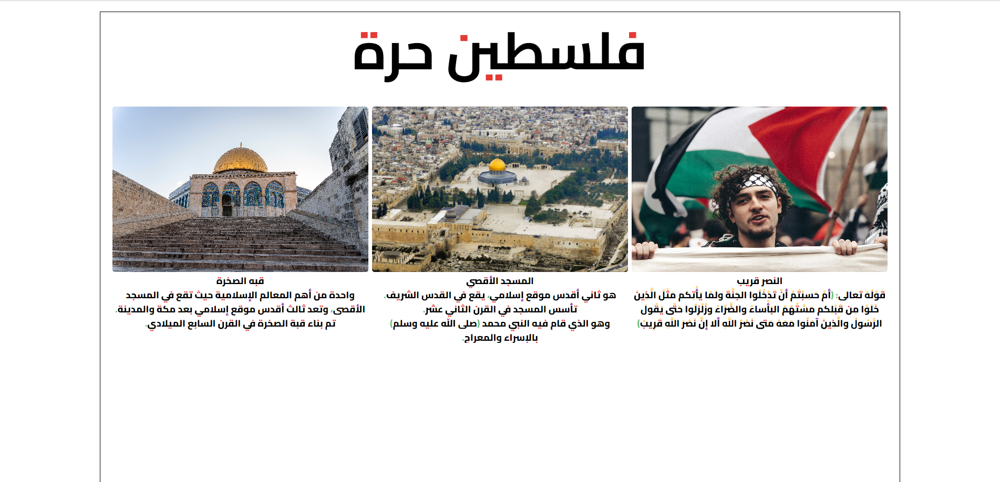

# Simple Animation Design with jQuery
# Demo 
[Go To Demo](https://mohammedelsisi21.github.io/jQuery_Animation/)

# Description

> This project showcases a clean and straightforward design, utilizing jQuery for smooth and engaging animations.
> The design features a section dedicated to the theme of Palestine, with a focus on iconic landmarks like Al-Aqsa Mosque and the Dome of the Rock.

## Key Features
- **Responsive Layout**: The design adjusts seamlessly across different screen sizes.
- **Smooth Animations**: Elements are revealed with smooth sliding and fading effects using jQuery.
- **RTL (Right-to-Left) Support**: The design supports right-to-left text alignment, making it ideal for Arabic content.

# Project ScreenShot 
